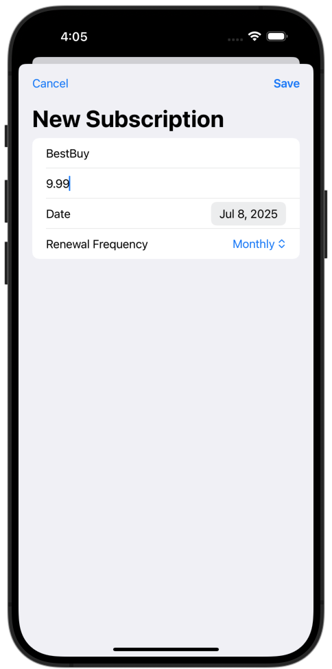
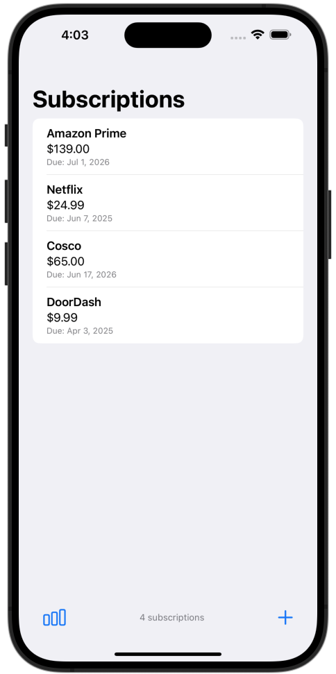
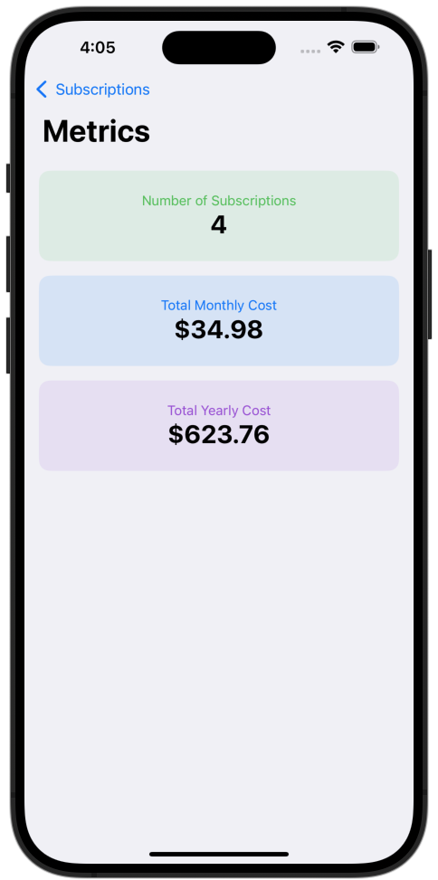

# 📱 SubTracker – iOS Subscription Tracker

**Early beta**

SubTracker is a simple and intuitive iOS-only app to help you keep track of your subscriptions. Whether it's Netflix, Spotify, or your gym membership, SubTracker keeps everything in one place so you never miss a renewal.

## 🧩 Features

- Add and manage all your recurring subscriptions
- Set amounts, renewal dates, and custom names
- See total monthly cost and individual metrics
- Archive past subscriptions
- Clean and easy-to-use interface

## 📸 Screenshots

### ➕ Add Subscription

### 🏠 Home View

### 📊 Metrics

## 📲 Platform

- iOS only
- Built with SwiftUI

---

Made with ❤️ for better budgeting and peace of mind.
